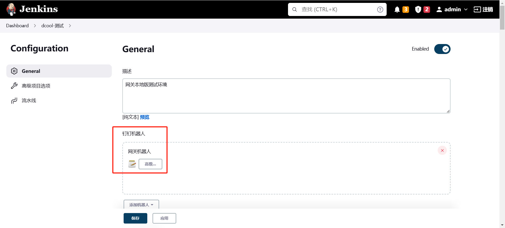
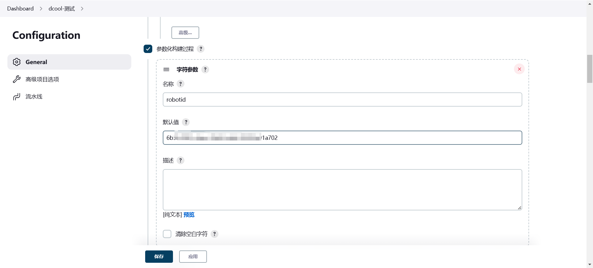
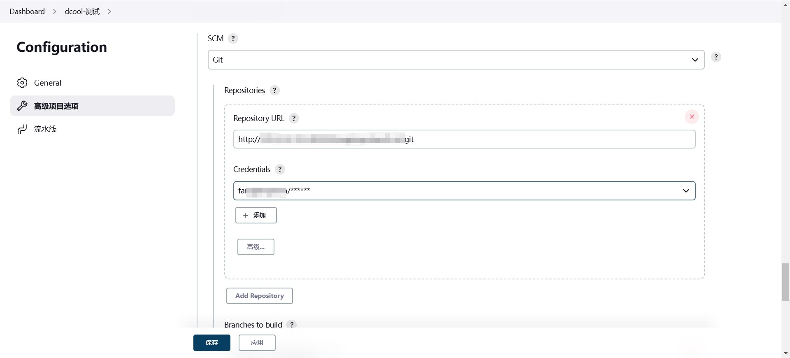
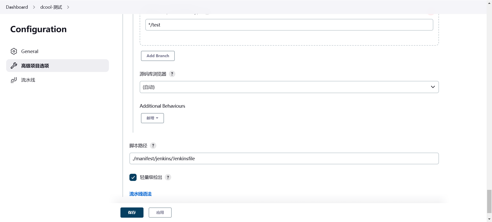
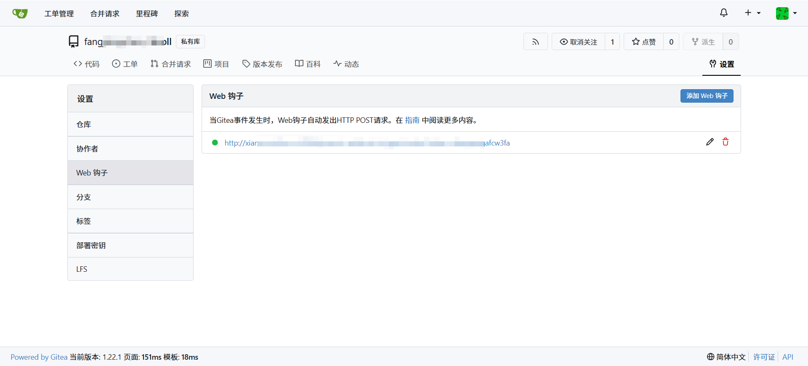
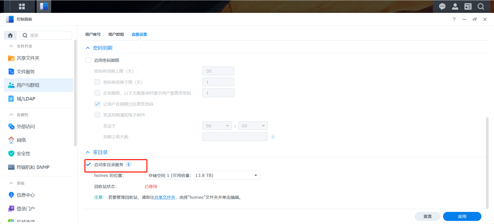
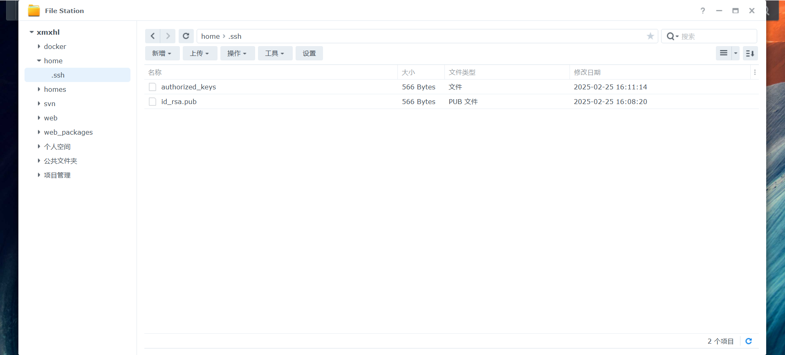
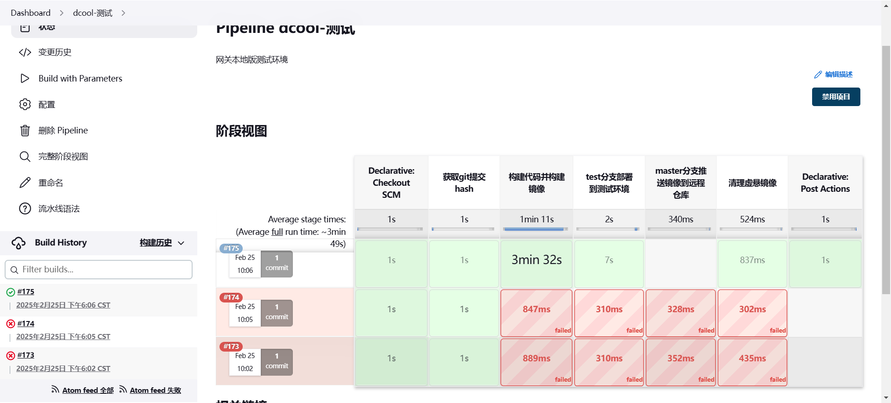
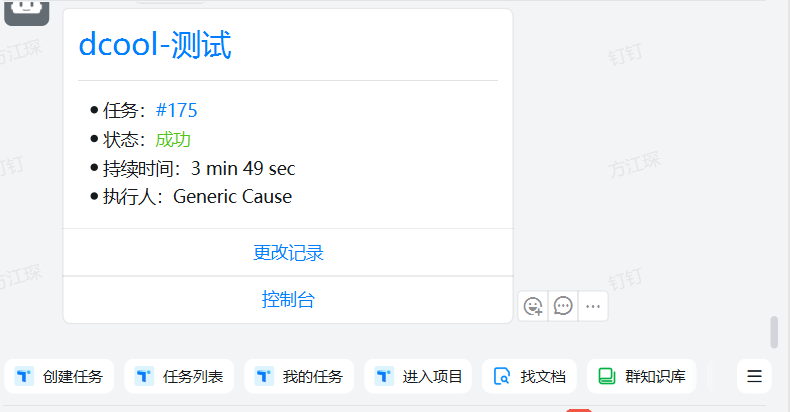
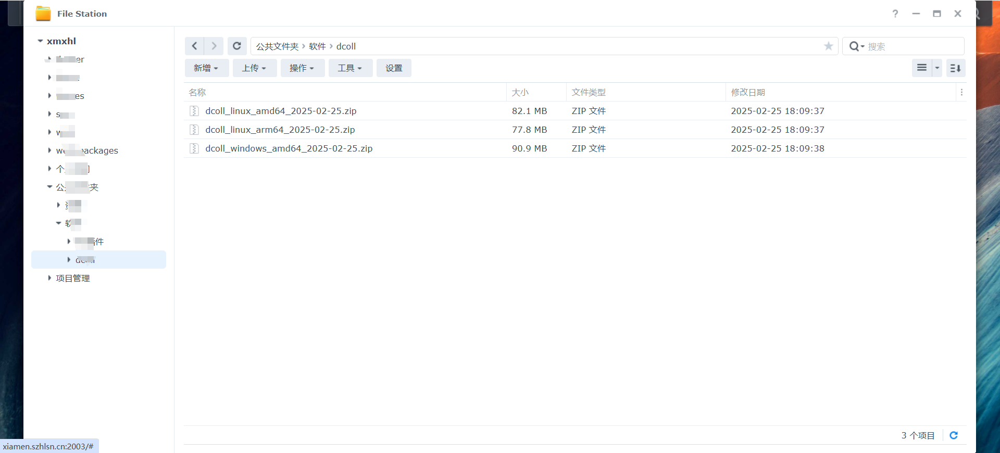

大家好，我是**不白炖**

今天我要给大家介绍的是如何使用Jenkins的pipeline实现go项目自动化打包部署并上传安装包到群晖NAS

### 背景：

公司很多项目的部署和发布都是手动的，每次发布都需要手动打包、上传到服务器、解压、重启服务等，这样不仅效率低，而且容易出错，为了提高效率，我们决定使用Jenkins的pipeline来实现go项目的自动化打包部署，并上传安装包到群晖NAS，方便分发给同事测试部署。

### 使用到的工具

* Jenkins
* Go
* 群晖NAS
* Git
* Gitea
* Docker

### 编写打包脚本

#### 编写Dockerfile

这里我们使用Dcoll数采网关的go项目为例，我们先编写一个**Dockerfile**文件用于go环境编译Dcoll项目，以及Dcoll插件的打包，以及上传到群晖NAS。

Dockerfile打包过程包含多个步骤，首先我们需要安装go环境，以及设置go mod代理，然后我们需要安装openssh-client和bash，用于后续的上传到群晖NAS，然后我们需要将密钥传递给容器并存储(不可将秘钥打包进去docker镜像内，有安全问题)，创建.ssh目录，配置SSH客户端，然后我们需要编译go项目，以及go插件，最后我们需要打包版本，上传到群晖NAS。

Dockerfile文件内容如下：

```Dockerfile
################################################
#               构建go可执行文件
################################################
FROM golang:1.23-alpine as builder

WORKDIR /app

# 拷贝模块文件
COPY go.mod .
COPY go.sum .

RUN go env -w GO111MODULE=on &&  \
    go env -w GOPROXY=https://goproxy.cn,direct && \
    go mod download

COPY . .

# 安装 openssh-client 和 bash
RUN apk update && apk add --no-cache \
    openssh-client \
    bash \
    zip

# 将密钥传递给容器并存储
ARG SSH_PRIVATE_KEY
ARG SSH_PUBLIC_KEY

# 创建 .ssh 目录
RUN mkdir -p /root/.ssh && \
    echo "$SSH_PRIVATE_KEY" > /root/.ssh/id_rsa && \
    echo "$SSH_PUBLIC_KEY" > /root/.ssh/id_rsa.pub && \
    chmod 600 /root/.ssh/id_rsa && \
    chmod 644 /root/.ssh/id_rsa.pub

# 配置 SSH 客户端，禁用主机密钥检查
RUN echo "Host 群晖NAS_IP\n\
    StrictHostKeyChecking no\n\
    UserKnownHostsFile /dev/null" >> /root/.ssh/config


RUN chmod 777 /app/manifest/docker/build.sh

RUN /app/manifest/docker/build.sh


################################################
#               构建运行镜像
################################################
FROM alpine:3
ENV WORKDIR /app
WORKDIR $WORKDIR

COPY --from=builder /app/dcoll_linux_amd64 $WORKDIR

RUN chmod +x $WORKDIR/main

VOLUME $WORKDIR/resource
VOLUME $WORKDIR/manifest

EXPOSE 4500

# 设置时区
ENV TZ Asia/Shanghai

RUN sed -i 's/dl-cdn.alpinelinux.org/mirrors.ustc.edu.cn/g' /etc/apk/repositories && apk add tzdata && cp /usr/share/zoneinfo/${TZ} /etc/localtime \
    && echo ${TZ} > /etc/timezone 
    # && apk del tzdata

# CMD ["./wait-for-it.sh","rabbitMQ:5672","-s","--","./main"]
CMD $WORKDIR/main

```

Dockerfile调用的build.sh文件内容如下：

```bash
#!/bin/sh

echo "开始编译..."

# 创建目录
mkdir -p /app/dcoll_linux_amd64/resource/plugin
mkdir -p /app/dcoll_windows_amd64/resource/plugin
mkdir -p /app/dcoll_linux_arm64/resource/plugin
mkdir -p /app/dcoll_linux_amd64/manifest/config
mkdir -p /app/dcoll_windows_amd64/manifest/config
mkdir -p /app/dcoll_linux_arm64/manifest/config

# 拷贝配置文件和静态资源
cp -r manifest/config /app/dcoll_linux_amd64/manifest
cp -r manifest/config /app/dcoll_windows_amd64/manifest
cp -r manifest/config /app/dcoll_linux_arm64/manifest
cp -r resource/public /app/dcoll_linux_amd64/resource/public
cp -r resource/public /app/dcoll_windows_amd64/resource/public
cp -r resource/public /app/dcoll_linux_arm64/resource/public
cp -r build/windows/* /app/dcoll_windows_amd64


echo "开始打包主程序..."

echo "开始编译dcoll的linux_amd64版本"
GOOS=linux GOARCH=amd64 go build  -o /app/dcoll_linux_amd64/main main.go
echo "开始编译dcoll的linux_arm64版本"
GOOS=linux GOARCH=arm64 go build  -o /app/dcoll_linux_arm64/main main.go
echo "开始编译dcoll的windows_amd64版本"
GOOS=windows GOARCH=amd64 go build  -o /app/dcoll_windows_amd64/main.exe main.go

echo "开始编译插件..."

# 编译版本
for project in /app/plugin/*; do
    if [ -d "$project" ]; then
        dirname=$(basename "$project")
        echo "开始编译${dirname}插件的Linux_amd64版本"
        GOOS=linux GOARCH=amd64 go build -o "/app/dcoll_linux_amd64/resource/plugin/${dirname}" "${project}/main.go"
        echo "开始编译${dirname}插件的windows_amd64版本"
        GOOS=windows GOARCH=amd64 go build -o "/app/dcoll_windows_amd64/resource/plugin/${dirname}.exe" "${project}/main.go"
        echo "开始编译${dirname}插件的linux_arm64版本"
        GOOS=linux GOARCH=arm64 go build -o "/app/dcoll_linux_arm64/resource/plugin/${dirname}" "${project}/main.go"
    fi
done

echo "开始打包版本..."

# 获取日期
date=$(date "+%Y-%m-%d")

echo "开始打包dcoll的linux_amd64版本zip包"
cd /app && zip -r dcoll_linux_amd64_${date}.zip dcoll_linux_amd64

echo "开始打包dcoll的linux_arm64版本zip包"
cd /app && zip -r dcoll_linux_arm64_${date}.zip dcoll_linux_arm64

echo "开始打包dcoll的windows_amd64版本zip包"
cd /app && zip -r dcoll_windows_amd64_${date}.zip dcoll_windows_amd64

# 上传到群晖
echo "开始上传到群晖..."
scp -o StrictHostKeyChecking=no dcoll_linux_amd64_${date}.zip 用户名@群晖NAS_IP:/公共文件夹/软件/dcoll
scp -o StrictHostKeyChecking=no dcoll_linux_arm64_${date}.zip 用户名@群晖NAS_IP:/公共文件夹/软件/dcoll
scp -o StrictHostKeyChecking=no dcoll_windows_amd64_${date}.zip 用户名@群晖NAS_IP:/公共文件夹/软件/dcoll

echo "编译结束"
```

#### 编写Jenkinsfile

我们需要在项目根目录下创建一个**Jenkinsfile**文件，用于Jenkins的pipeline自动化部署，这个Jenkinsfile进行了多个步骤，包括构建镜像、推送镜像、部署到测试环境、推送镜像到远程仓库、清理虚悬镜像等。

```groovy
pipeline {
    agent any
        environment{
        app = '项目名称'
        registry = '私有仓库地址'
        registryUser = "仓库账号名"
        registryPassword = "仓库密码"
        changeString = ""
        gitHash=""
        gitBranch = "分支"
        port="映射端口"
        internalPort="服务端口"
        dockerfilePath="Docker文件地址"
        network="网络"
        SSH_PRIVATE_KEY='''秘钥'''
        SSH_PUBLIC_KEY="公钥"

    }
    // 存放所有任务的合集
    stages {
        stage('获取git提交hash') {
            steps {
                script {
                    // 获取Git版本的哈希值
                    gitHash= sh(returnStdout: true, script: 'git rev-parse --short=10 HEAD').trim()
                    echo "Git版本的哈希值: ${gitHash}"
                    // 获取Git分支
                    gitBranch = env.GIT_BRANCH.replace('origin/', '')
                    echo "Git分支: ${gitBranch}"
                }
            }
        }

        stage('构建代码并构建镜像') {
            steps {
                echo '构建代码并构建镜像'
                 sh 'docker build --build-arg SSH_PRIVATE_KEY="${SSH_PRIVATE_KEY}" --build-arg SSH_PUBLIC_KEY="${SSH_PUBLIC_KEY}" --build-arg -t ${registry}/xhl/${app}:latest  -f ${dockerfilePath} .'
            }
        }
        stage('test分支部署到测试环境') {
            when {
                expression {
                    if (gitBranch == "test"){ 
                        return true
                    }
                    return false
                }
            }
            steps {
                sh 'docker stop ${app} || true && docker rm ${app} || true && \
                docker run -d -t --name ${app} \
                --restart=always \
                --network ${network} \
                -p ${port}:${internalPort} \
                -e MQTT=\'{"broker":"tcp://nanomq:1883"}\' \
                ${registry}/xhl/${app}:latest'
            }
        }
        stage('master分支推送镜像到远程仓库') {
            when {
                expression {
                    if (gitBranch == "master"){ 
                        return true
                    }
                    return false
                }
            }
            steps {
                echo '推送镜像到远程仓库'
                sh "docker login -u ${registryUser} -p ${registryPassword} ${registry} && docker push ${registry}/xhl/${app}:latest && docker push ${registry}/xhl/${app}:${gitHash}"  
            }
        }
        stage('清理虚悬镜像') {
            steps {
                echo '清理虚悬镜像'
                sh 'docker image prune -f'
            }
        }
    }
    post{
        success{
            script{
                changeString = getChangeString()
            }
            dingtalk(
                robot: '${robotid}',
                type: "MARKDOWN",
                title: 'iot-clouds 升级日志',
                text: [
                    "# iot-clouds 升级日志",
                    "## 升级内容：",
                    "${changeString}"]
            )
        }
    }
}


def getChangeString() {
    MAX_MSG_LEN = 100
    def changeString = ""
 
    echo "Gathering SCM changes"
    def changeLogSets = currentBuild.changeSets
    for (int i = 0; i < changeLogSets.size(); i++) {
        def entries = changeLogSets[i].items
        for (int j = 0; j < entries.length; j++) {
            def entry = entries[j]
            truncated_msg = entry.msg.take(MAX_MSG_LEN)
            commitTime = new Date(entry.timestamp).format("yyyy-MM-dd HH:mm:ss")
            changeString += " - ${truncated_msg} [${entry.author} ${commitTime}]\n"
        }
    }
    if (!changeString) {
        changeString = " - No new changes"
        
    }
    return changeString
}
```


### 配置软件

#### 配置Jenkins

我们需要在Jenkins中安装Docker插件，以及配置Docker的镜像仓库，以及配置SSH密钥，以及配置Jenkins的pipeline。还得配置Jenkins的webhook，以及配置Jenkins的钉钉通知以及git地址。






#### 配置Gitea

我们需要在Gitea中配置webhook，配置上Jenkins的地址和token。



#### 配置群晖NAS

我们需要在群晖NAS中配置共享文件夹，以及配置用户权限，以及配置SSH登录和公钥，首先得开启用户目录，并且在用户目录下新建一个.ssh文件夹，并且在里面创建一个authorized_keys文件，里面写入公钥，然后在Jenkins中配置私钥和公钥。




### 最终效果

我们可以看到，我们的go项目在每次提交代码后，Jenkins会自动构建镜像，然后推送到远程仓库，然后部署到测试环境，然后清理虚悬镜像，最后我们可以在钉钉中看到升级日志，在群晖共享目录也能看到软件版本，分享文件夹链接后就能自由下载软件新版本了。





### 总结

通过本文的介绍，我们可以看到，使用Jenkins的pipeline可以很方便的实现go项目的自动化打包部署，并上传安装包到群晖NAS，这样我们可以很方便的将go项目集成到我们的项目中，实现自动化部署。希朋本文对大家有所帮助，谢谢大家的阅读。我们下期见