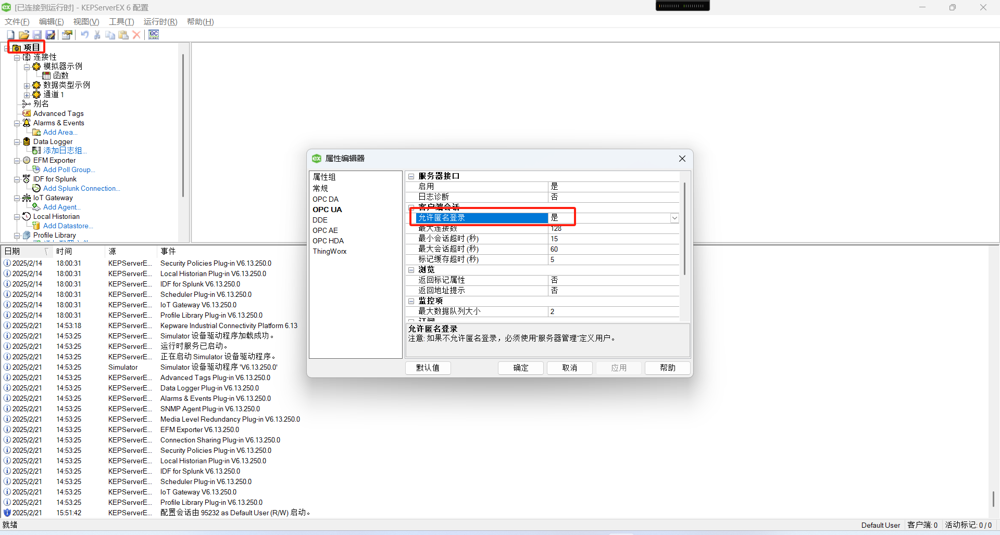
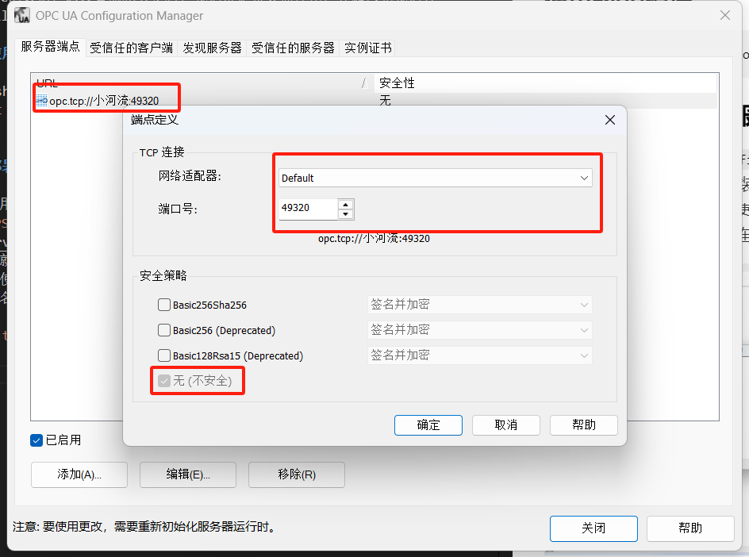
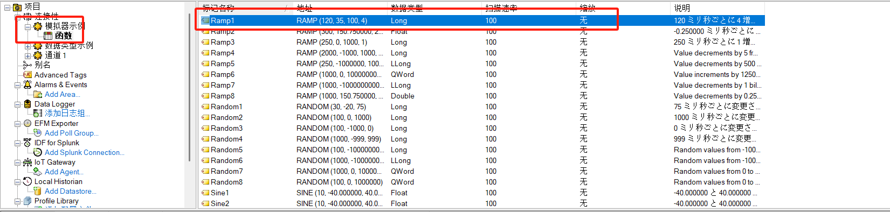
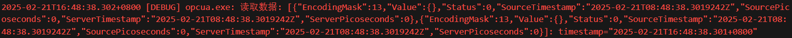
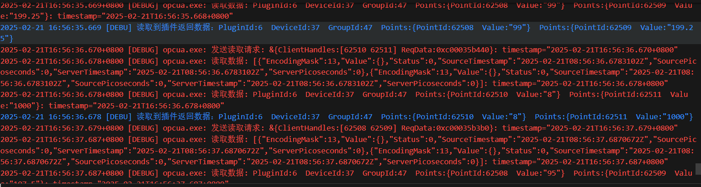
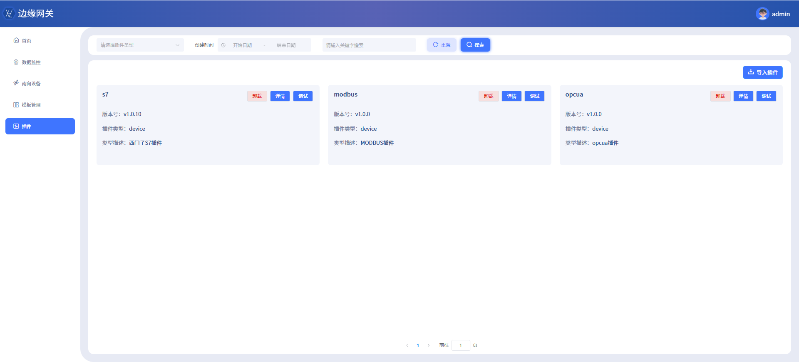
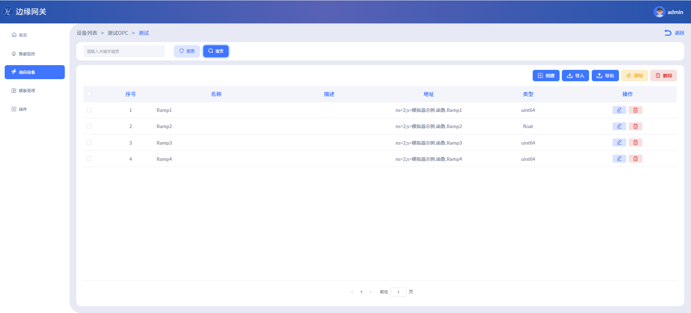
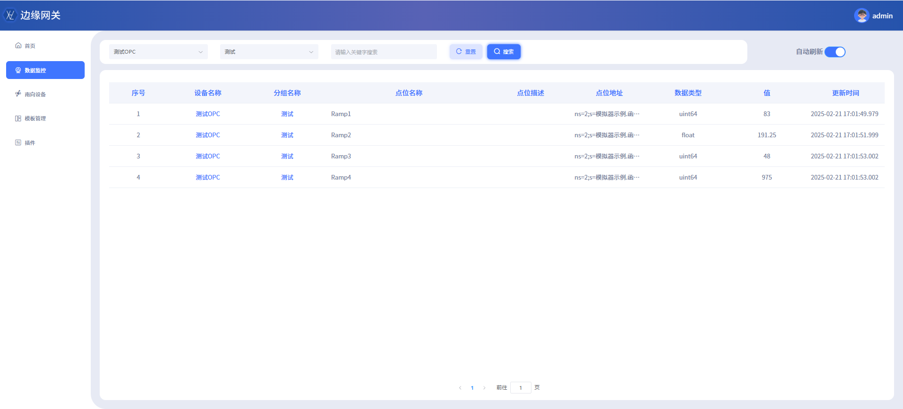

大家好，我是**不白炖**

今天我要给大家介绍的是如何用go的opcua库实现OPC-UA客户端，以及如何连接到OPC UA服务器并读取、订阅数据

### 背景：

公司接到了一个新项目，第三方公司已经通过`KEPServerEX 6 Configuration`软件采集到西门子PLC的数据，我们需要通过OPC UA协议连接到第三方公司`KEPServerEX 6 Configuration`提供的OPC UA服务器，读取PLC的数据，通过查阅相关资料，我们决定将其插件化，并加入到我们公司Dcoll数采网关中，以便于后续的数据处理。

### 使用的go模块

```bash
go get github.com/gopcua/opcua
```

### 部署测试OPC UA服务器

我们使用`KEPServerEX 6 Configuration`软件模拟一个OPC UA服务器，
到[KEPServerEX官网](https://www.ptc.com/en/products/kepware/kepserverex/demo-download)下载安装软件，安装完成后，打开软件，软件自带就有一个模拟设备，我们可以直接使用。这边需要注意的是，我们测试默认使用无账户，无加密的方式，所以在连接的时候需要注意，配置设备允许匿名账户






### 代码实现

#### 创建客户端

我们先使用opcua.NewClient方法创建一个客户端，然后使用client.Connect方法连接到OPC UA服务器。注意KEPServerEX OPC UA默认端口是49320，如果提示认证失败或者用户没权限请检查是否开启了匿名账户访问以及是否配置了无加密访问。

```go

// 建立连接
func (g *Group) connect(ctx context.Context) (err error) {
	if g.deviceClient == nil {
		c, err := opcua.NewClient(g.config.Address, opcua.SecurityMode(g.secMode), opcua.SecurityPolicy(g.secPolicy))
		if err != nil {
			return gerror.WrapCodef(CannotConnectToDeviceCode, err, "创建设备实例失败: %s", g.config.Address)
		}
		if err := c.Connect(ctx); err != nil {
			return gerror.WrapCodef(CannotConnectToDeviceCode, err, "连接设备失败: %s", g.config.Address)
		}
		g.deviceClient = c
	}
	return
}

```

#### 使用Read读取数据

OPC UA采用节点的方式来管理数据，我们需要先获取节点，然后读取数据。KEPServerEX默认创建了一个`模拟器示例`的设备，下面有一个`函数`通道，里面有很多点位，这里我们选择`Ramp1`节点，读取其值。因为KEPServerEX默认NS为2，所以我们需要在读取的时候指定NS为2，所以我们读取的节点为`ns=2;s=模拟器示例.函数.Ramp1`



使用read方法读取数据，需要注意的是一些错误处理。

```go
// 发送读取报文
func (g *Group) sendReadRequest(ctx context.Context, req *ReadPollData) (resDataValue []*ReadValue, err error) {
	g.log.Debug(fmt.Sprintf("发送读取请求: %+v", req))
	var resp *ua.ReadResponse
	for {
		resp, err = g.deviceClient.Read(ctx, req.ReqData)
		if err == nil {
			break
		}

		switch {
		case err == io.EOF && g.deviceClient.State() != opcua.Closed:
			g.log.Warn("非用户正常关闭读取流，尝试重新读取")
			time.After(1 * time.Second)
			continue

		case errors.Is(err, ua.StatusBadSessionIDInvalid):
			g.log.Warn("SessionID未激活，尝试重新读取")
			time.After(1 * time.Second)
			continue

		case errors.Is(err, ua.StatusBadSessionNotActivated):
			g.log.Warn("Session无效，尝试重新读取")
			time.After(1 * time.Second)
			continue

		case errors.Is(err, ua.StatusBadSecureChannelIDInvalid):
			g.log.Warn("SecureChannelID无效，尝试重新读取")
			time.After(1 * time.Second)
			continue

		default:
			return nil, gerror.WrapCodef(NotConnectedCode, err, "读取数据失败: %+v", req)
		}
	}
	if resp != nil {
		g.log.Debug(fmt.Sprintf("读取数据: %+v", resp.Results))
		for k, result := range resp.Results {
			if result.Status != ua.StatusOK {
				g.log.Error(fmt.Sprintf("读取数据失败: %s", result.Status.Error()))
			} else {
				resDataValue = append(resDataValue, &ReadValue{
					ClientHandle: req.ClientHandles[k],
					Value:        gconv.String(result.Value.Value()),
				})
			}
		}
	}
	return resDataValue, nil
}
```

可以看到读取到的数据，这边需要注意的是同时读取多个数据的话，返回的数据是一个数组，我们需要根据读取的顺序来解析数据。



#### 使用Subscription订阅数据

我们可以使用Subscription来订阅数据，这样可以实时获取数据，而不需要每次都去读取数据。

```go
for {
    select {
    case <-ctx.Done():
        return
    case <-g.stopCh:
        g.log.Debug("停止订阅数据")
        <-g.runingCh
        g.log.Debug("重新开始订阅数据")
    default:
        notifyCh := make(chan *opcua.PublishNotificationData)
        sub, err := g.deviceClient.Subscribe(ctx, &opcua.SubscriptionParameters{
            Interval: g.config.PacketSendingIntervalOrSubscribeMinInterval,
        }, notifyCh)
        if err != nil {
            g.SetError(gerror.WrapCodef(CannotConnectToDeviceCode, err, "订阅数据失败: %+v", g.tags))
            break
        }
        g.sub = sub
        var reqs []*ua.MonitoredItemCreateRequest
        for _, tag := range g.tags {
            reqs = append(reqs, opcua.NewMonitoredItemCreateRequestWithDefaults(tag.NodeId, ua.AttributeIDValue, tag.PointId))
        }
        res, err := sub.Monitor(ctx, ua.TimestampsToReturnBoth, reqs...)
        if err != nil {
            g.SetError(gerror.WrapCodef(CannotConnectToDeviceCode, err, "监控数据失败: %+v", g.tags))
            break
        }
        g.log.Info("订阅数据成功")
        if res != nil {
            for _, item := range res.Results {
                if item.StatusCode != ua.StatusOK {
                    g.SetError(gerror.Newf("监控节点%s数据失败: %s", item.FilterResult.TypeID.NodeID.String(), item.StatusCode.Error()))
                }
            }
        }
        for {
            select {
            case <-ctx.Done():
                return
            case res := <-notifyCh:
                g.log.Debug(fmt.Sprintf("收到订阅数据: %+v", res))
                if res.Error != nil {
                    g.log.Error(fmt.Sprintf("订阅数据失败: %s", res.Error.Error()))
                    break
                }
                switch x := res.Value.(type) {
                case *ua.DataChangeNotification:
                    parseData, err := g.parseResponseData(ctx, x)
                    if err != nil {
                        g.log.Error(fmt.Sprintf("读取解析响应数据失败: %+v", err))
                    } else {
                        g.SendDataToCallback(ctx, parseData)
                    }
                default:
                    g.log.Error(fmt.Sprintf("不支持的订阅类型响应数据: %s", x))
                }
            }
        }
    }
}
```

可以看到，我们订阅的数据会源源不断的推送到我们的回调函数中，我们可以在回调函数中处理数据。



### 最终效果

整合到DColl数采网关中，我们可以看到数据源源不断的推送到我们的数据处理模块中，我们可以实时的处理数据。





### 总结

通过本文的介绋，我们可以看到，使用go的opcua库可以很方便的实现OPC UA客户端，连接到OPC UA服务器，读取、订阅数据。这样我们可以很方便的将OPC UA协议集成到我们的项目中，实现数据的采集。该库还支持写入数据、订阅数据变化等功能，可以根据实际需求进行扩展。

希望本文对大家有所帮助，谢谢大家的阅读。我们下期见