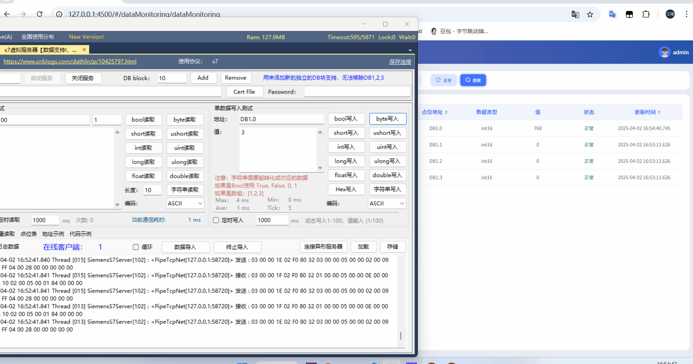

大家好，我是**不白炖**

今天我要给大家介绍的是如何在go上实现sse服务端，以及如何使用sse协议推送数据到客户端。服务端使用到的`Gofrme`框架（非常推荐的WEB框架以及工具库），以及客户端使用到js的`EventSource`对象。

### 背景：

dcoll之前使用http轮询获取点位数据，这样会导致大量的http请求，对服务器造成压力，而且数据不是实时的，刚好最近gf的作者发布了一篇在goframe中实现sse的文章，于是我决定使用sse协议来推送数据到客户端，以便于实时获取数据。

### SSE协议介绍

`SSE（Server-Sent Events）`是一种服务器推送技术，允许服务器通过HTTP连接向客户端发送实时更新。与WebSocket不同，SSE是单向通信机制，只能从服务器向客户端推送数据，不支持客户端向服务器发送数据。所以一般机制是客户端向服务器发送一个SSE请求后，服务器保持连接，然后客户端通过http向服务主动订阅一些数据，服务器在有数据更新时主动推送数据到客户端。


### 使用的go模块

```bash
go get github.com/gogf/gf/v2
```


### 代码实现

#### 服务端

dcoll项目使用的是`Gofrme`框架，所以我们先在logic目录下创建一个sse服务端的文件，然后在其中实现sse服务端。以下代码主要实现了sse服务端的创建、消息发送、广播消息等功能。其中`Create`方法用于创建sse连接，`SendToClient`方法用于向指定客户端发送消息，`BroadcastMessage`方法用于向所有客户端广播消息，`heartbeatSender`方法用于定时发送心跳包。这里我们使用的客户端id是采用与我们的授权系统jwt里面存储的客户端一致，这样我们就可以根据客户端id来向指定客户端发送消息。代码如下：


```go
package sse

import (
	"context"
	"dcoll/internal/consts"
	"dcoll/internal/service"
	"fmt"
	"time"

	"github.com/gogf/gf/v2/container/gmap"
	"github.com/gogf/gf/v2/net/ghttp"
)

// Client 表示SSE客户端连接
type sseClient struct {
	Id          string
	Request     *ghttp.Request
	messageChan chan string
}

// sSse SSE服务
type sSse struct {
	clients *gmap.StrAnyMap // 存储所有客户端连接
}

// New 创建SSE服务实例
func New() *sSse {
	return &sSse{
		clients: gmap.NewStrAnyMap(true),
	}
}

func init() {
	s := New()
	go func() {
		s.heartbeatSender()
	}()
	service.RegisterSse(s)
}

// Create 创建SSE连接
func (s *sSse) Create(ctx context.Context) {
	r := ghttp.RequestFromCtx(ctx)
	// 设置SSE必要的HTTP头
	r.Response.Header().Set("Content-Type", "text/event-stream")
	r.Response.Header().Set("Cache-Control", "no-cache")
	r.Response.Header().Set("Connection", "keep-alive")
	r.Response.Header().Set("Access-Control-Allow-Origin", "*")

	// 通过jwt信息获取客户端id
	clientId := service.User().GetClientIdFromCtx(ctx)

	client := &sseClient{
		Id:          clientId,
		Request:     r,
		messageChan: make(chan string, 1000),
	}

	// 注册客户端
	s.clients.Set(clientId, client)

	// 客户端断开连接时清理
	defer func() {
		s.clients.Remove(clientId)
		close(client.messageChan)
	}()

	// 发送连接成功消息
	r.Response.Writefln("id: %s\n", clientId)
	r.Response.Writefln("event: %s\n", consts.SseEventTypeConnect)
	r.Response.Writefln("data: {\"status\": \"%s\", \"%s\": \"%s\"}\n", consts.SseClientStatusConnected, consts.SseClientId, clientId)
	r.Response.Flush()

	// 处理消息发送
	for {
		select {
		case msg, ok := <-client.messageChan:
			if !ok {
				return
			}
			// 向客户端发送消息
			r.Response.Writefln(msg)
			r.Response.Flush()

		case <-r.Context().Done():
			// 客户端断开连接
			service.Monitor().ClearClientMonitorPointsByClientId(ctx, clientId)
			service.Device().DeleteSubStatusClient(clientId)
			return
		}
	}
}

// SendToClient 向指定客户端发送消息
func (s *sSse) SendToClient(clientId, eventType, data string) bool {
	if client := s.clients.Get(clientId); client != nil {
		c := client.(*sseClient)
		msg := fmt.Sprintf(
			"id: %d\nevent: %s\ndata: %s\n\n",
			time.Now().UnixNano(), eventType, data,
		)
		// 尝试发送消息，如果缓冲区满则跳过
		select {
		case c.messageChan <- msg:
			return true
		default:
			return false
		}
	}
	return false
}

// BroadcastMessage 向所有客户端广播消息
func (s *sSse) BroadcastMessage(eventType, data string) int {
	count := 0
	s.clients.Iterator(func(k string, v interface{}) bool {
		if s.SendToClient(k, eventType, data) {
			count++
		}
		return true
	})
	return count
}

// heartbeatSender 定时发送心跳包
func (s *sSse) heartbeatSender() {
	ticker := time.NewTicker(30 * time.Second)
	defer ticker.Stop()

	for range ticker.C {
		s.clients.Iterator(func(k string, v interface{}) bool {
			client := v.(*sseClient)
			select {
			case client.messageChan <- ": heartbeat\n\n":
				// 心跳包发送成功
			default:
				// 消息缓冲区满，可能客户端已断开
			}
			return true
		})
	}
}

```
接下来我们创建一个服务，用于注册sse服务(可以使用gf客户端工具`gf gen service`快速创建)，代码如下：

```go
// ================================================================================
// Code generated and maintained by GoFrame CLI tool. DO NOT EDIT.
// You can delete these comments if you wish manually maintain this interface file.
// ================================================================================

package service

import (
	"context"
)

type (
	ISse interface {
		// Create 创建SSE连接
		Create(ctx context.Context)
		// SendToClient 向指定客户端发送消息
		SendToClient(clientId string, eventType string, data string) bool
		// BroadcastMessage 向所有客户端广播消息
		BroadcastMessage(eventType string, data string) int
	}
)

var (
	localSse ISse
)

func Sse() ISse {
	if localSse == nil {
		panic("implement not found for interface ISse, forgot register?")
	}
	return localSse
}

func RegisterSse(i ISse) {
	localSse = i
}

```

接下来我们使用`Gofrme`框架使用标准路由创建一个sse服务，代码如下：

```go
package v1

import "github.com/gogf/gf/v2/frame/g"

type CreateReq struct {
	g.Meta `path:"/sse" method:"get" summary:"创建SSE连接"`
}

type CreateRes struct {
}

```

接下来我们创建一个控制器，用于处理sse服务的创建请求（可以使用gf客户端工具`gf gen ctrl`快速创建），代码如下：

```go

package sse

import (
	"context"

	v1 "dcoll/api/sse/v1"
	"dcoll/internal/service"
)

func (c *ControllerV1) Create(ctx context.Context, req *v1.CreateReq) (res *v1.CreateRes, err error) {
	service.Sse().Create(ctx)
	return
}

```

最后我们在路由中注册sse服务，这样sse服务端就实现好了，剩下就是具体业务数据推送了。代码如下：

```go
package router

import (
	"dcoll/internal/controller/device"
	"dcoll/internal/controller/event"
	"dcoll/internal/controller/file"
	"dcoll/internal/controller/gateway"
	groupController "dcoll/internal/controller/group"
	"dcoll/internal/controller/log"
	"dcoll/internal/controller/login"
	"dcoll/internal/controller/monitor"
	"dcoll/internal/controller/plugin"
	"dcoll/internal/controller/point"
	"dcoll/internal/controller/sse"
	"dcoll/internal/controller/statistics"
	"dcoll/internal/controller/stencil"
	"dcoll/internal/controller/system"
	"dcoll/internal/controller/user"
	"dcoll/internal/service"

	"github.com/gogf/gf/v2/net/ghttp"
)

// 绑定路由
func BindController(group *ghttp.RouterGroup) {
	group.Group("/api", func(group *ghttp.RouterGroup) {
		group.Group("/v1", func(group *ghttp.RouterGroup) {
			// 绑定默认响应中间件
			group.Middleware(ghttp.MiddlewareHandlerResponse)
			// 绑定跨域中间件
			group.Middleware(ghttp.MiddlewareCORS)
			// 绑定登录验证中间件
			group.Middleware(service.Middleware().Auth)
			// 绑定编辑权限中间件
			group.Middleware(service.Middleware().CanEdit)

			// sse模块
			group.Bind(sse.NewV1())
		})
	})
}

```

#### 客户端

客户端使用的是js的`EventSource`对象，通过`EventSource`对象可以很方便的实现sse客户端。我们将其注册在vue路由主键中，在可以获取token的地方注册，这样就能维护一个全局的`EventSource`对象，代码如下：

```js
import { defineStore } from "pinia";
import { useUserStore } from "@/stores/user";


export const baseURL = import.meta.env.VITE_API_URL;
const token = useUserStore().getToken();

export const eventSource = defineStore("eventSource", {
    state: () => ({
        eventSource: null as EventSource | null,
    }),
    getters: {
        
    },
    actions: {
        newEventSource() {
            if (!this.eventSource) {
                this.eventSource = new EventSource(baseURL+"/sse?token="+token);
                this.eventSource.onopen = () => {
                    console.log("SSE opened");
                };
                this.eventSource.onerror = (error) => {
                    console.error('EventSource 错误:', error);
                };
            }
        },
        closeEventSource() {
            if (this.eventSource) {
                this.eventSource.close();
                this.eventSource = null;
            }
        },
    },
});

```

通过注册事件监听器，我们可以监听到服务端推送的消息，这边需要注册的是多次注册相同的事件会推送多次，以及取消注册事件要和注册事件用的是同一个函数，不然会出现无法取消注册的问题，导致重复推送。代码如下：

```js
const updateMontiorValue = (e: any) => {
	const data = JSON.parse(e.data);
	console.log("点位监控数据", data);
	data.forEach((item: any) => {
		for (let i = 0; i < state.monitorList.length; i++) {
			if (state.monitorList[i].pointId == item.PointId) {
				state.monitorList[i].value = item.Value;
				state.monitorList[i].status = item.Status;
				state.monitorList[i].updateAt = item.UpdateAt;
			}
		}
	});
}

const changeMonitorPoint = () => {
	event.eventSource?.addEventListener("monitor_points", updateMontiorValue);
};
onMounted(() => {
	getMonitorListFun();
	changeMonitorPoint();
});

onUnmounted(() => {
	event.eventSource?.removeEventListener("monitor_points", updateMontiorValue);
});

```

### 运行

运行项目后，我们可以通过浏览器访问`http://localhost:8080/api/v1/sse`，这样就可以创建一个sse连接，然后我们可以通过服务端向客户端发送消息，客户端就可以接收到消息了。

下面是实现效果：




### 总结

本文主要介绍了如何在go语言上实现sse服务端，以及如何使用sse协议推送数据到客户端。通过sse协议，我们可以实现服务端主动推送数据到客户端，这样就可以实现实时数据推送。sse协议是一种很好的实现实时数据推送的协议，但是它只能从服务端向客户端推送数据，不支持客户端向服务端发送数据，所以在一些需要双向通信的场景下，可能需要使用WebSocket或者MCP协议。